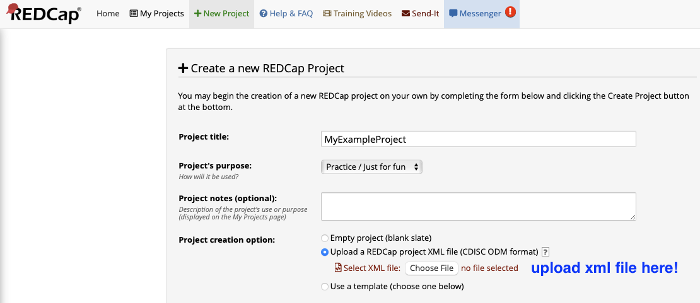

# vu-brownbag2022-shinyredcap
 Slides and code for April 19, 2022 Brown Bag talk at Vanderbilt University

## Repository directory

* `notebooks/`: contains R Notebooks used to illustrate specific concepts or building blocks
* `shiny_app_examples/`: example shiny apps you can modify and expand upon at your leisure
  * `clinical_dashboard`
    * `clinical_dashboard_01_simple/app.R`: minimal example, coded in base `shiny` + `REDCapR` + some `tidyverse`, provided for initial learning and playing around. Associated with the clinical questionnaire dataset provided in `redcap_templates`.
    * `clinical_dashboard_02_dyninput/app.R`: expands upon `01` by adding a dynamic input that lists subject IDs from all that are currently present
    * `clinical_dashboard_03_fancy/app.R`: brutally expands upon `02` by incorporating various "nice-ifying" bells and whistles:
      * Classier inputs using  `shinyWidgets`
      * Fancier layout using `shinyDashboard`
      * Formatted data table output for questionnaires using `DT`
      * Second layer of plot reactivity: rough or smoothed total score curve
* `slides/`: .Rpres slides used in brown bag talk
* `redcap_templates/`: template REDCap projects (with and without data) for use with the shiny app examples.

## Prerequisites

- R (I am using 4.1.3)
- R Studio
- Various R packages (see each file for specific details; most require `tidyverse` and `shiny` at a minimum).

## REDCap setup

**If you would like to use the prebuilt REDCap projects that work with the attached Shiny apps:**

Create a new REDCap project using the included XML files. The dashboard likely will crash if there is no data, so I would advise using the version that has made up data included if you are trying to have a playground for development.

**For all projects (provided or yours):**

1. Ensure you have the appropriate rights set up. For the attached projects, you will need data export rights and API export access. (*Word of caution: be VERY thoughtful about who and if you should give a user API **import** access, as they could mess up the project if they don't know what they're doing!!!*)

2. Generate a REDCap API key using the instructions provided by REDCap here: https://redcap.vanderbilt.edu/api/help/?content=tokens
3. VERY IMPORTANT: **DO NOT hardcode** your API keys in your code. Instead, follow the instructions in the `notebooks/redcap_01_setting_up_keys.Rmd` file or some more secure alternative!